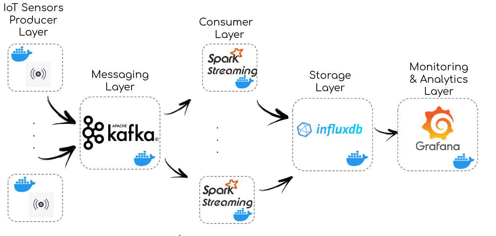

# Second_project_pantheon_precision_farming

## Introduction
This project is the final assignement for the master course in Big Data at Roma Tre University.<br/>
It contains an architecture for acquiring data from iot-sensors, saving and visualizing it in real time for monitoring and analytics purposes.<br/>
The data comes from the Pantheon project and the domain is precision agriculture. See [here](http://pantheon.inf.uniroma3.it/) for more information about it. <br/>
The data showed here refer to the second half of 2020 and are time series containing measurements of various type of real sensors placed in hazelnut orchards. 
Since the data was available in batch as csv files (see [data](./data) directory) we simulated each sensor creating scripts that read one data entry at a time (the real sensor sends data every 5 minutes, for time purposes our scripts send a data entry each 0.1 seconds).<br/>

## Overall architecture


In the package iot-producer there is a python script that emulate each sensor. Each script reads one data entry every 0.1 seconds (the time is defined in [properties.ini](./iot-sensor-producer/properties.ini) as sleeptimebetweenrows) and sends it in the kafka topic for that sensor; there are 8 sensors in total (6 representing the weather stations and 2 representing the soil sensors).

Meanwhile in the package iot-consumer there is a python script with the responsibility of taking in all the messages every 10 seconds from kafka-topics, verifying the integrity of each message and then saving it in influxDB. The consumer instance is replicated 5 times (each kafka-topic is partioned with the same number) so that the consumers can keep it up with the rate at which the messages are produced.

## Developer's notes
- To start-up only the DB instance and grafana to see the created dashboards with all the data already in it use the following command: 
  <br/>     ``` sudo ./scripts/start-up-only-grafana.sh ```
- Grafana is listening on port 3000 so open the browser and go to ``` localhost:3000 ```, then type admin (as username) and admin (as password). Go to the Dashboards menu, manage and then click on the terrain dashboard to see all the data about soil fields or on the weather station dashboard to see all the data about weather.  
- For a clean (with an empty DB instace) start-up of all the containers, to see all the system at work, run the following command (be careful it will wipe out all the data already stored in the [influxdb_data directory](./disk/influxdb_data/)): 
<br/>       ``` sudo ./scripts/start-up-clean.sh ```
- To start-up all the sensors and consumers mantaining old data in the DB run the following command: 
<br/>       ``` sudo ./scripts/start-up-clean.sh ```

**N.B. when cloning the repo there are already all the data in the [influxdb_data directory](./disk/influxdb_data/) to avoid losing time waiting all the sensors sending data and to be able to see the final result in the grafana dashboards.** 

## Contributors
- [Ilaria Stocchi](https://github.com/IlariaStocchi/)
- [Mattia Scaccia](https://github.com/MattiaScaccia/)
